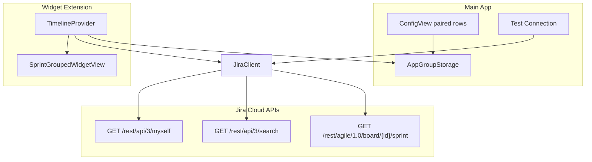

# Jira Sprint Tracker — macOS Widget App

## Agreed Design Decisions

| Area | Decision |
|------|----------|
| Audience | Team-internal; each teammate runs their own copy with their own Atlassian API token |
| Scope | Up to **3 paired rows**: Project Key + Board ID |
| Widget layout | **Grouped by Sprint** — each sprint gets its own header, progress bar, countdown, and task list |
| Board resolution | **Manual Board ID** per project (no auto-discovery) |
| Done progress | `status.statusCategory.key == "done"` |
| Overflow | Fit TaskCards per section, show **"+N more"** when clipped |
| Errors | **Inline widget messages** only (no stale-cache fallback) |
| Refresh | **30 min** timeline + refresh on widget add + refresh when main app opens |
| Priority colors | Local map from Jira priority name/ID → fixed palette |
| Sprints shown | All **open sprints** per board that have user-assigned tasks |
| Config UX | **Test Connection** button validates auth + each project/board pair |
| Project path | [`~/jira-tracker-widget`](~/jira-tracker-widget) |
| App name | **Jira Sprint Tracker** |
| Docs | README for teammate setup |

## Architecture



## Project Structure

Create a new Xcode project at `~/jira-tracker-widget`:

```
jira-tracker-widget/
├── JiraSprintTracker/              # macOS app target
│   ├── JiraSprintTrackerApp.swift
│   ├── Views/ConfigView.swift
│   └── Views/ProjectBoardPairRow.swift
├── JiraSprintTrackerWidget/        # Widget extension target
│   ├── JiraSprintTrackerWidget.swift
│   ├── JiraWidgetProvider.swift
│   └── Views/
│       ├── WidgetRootView.swift
│       ├── SprintSectionView.swift
│       └── TaskCardView.swift
├── Shared/                         # Shared by app + widget
│   ├── Storage/AppGroupStorage.swift
│   ├── Networking/JiraAPIClient.swift
│   ├── Models/JiraModels.swift
│   └── Constants/PriorityColors.swift
└── README.md
```

**Bundle IDs (recommended):**
- App: `com.lmwn.JiraSprintTracker`
- Widget: `com.lmwn.JiraSprintTracker.widget`
- App Group: `group.com.lmwn.JiraSprintTracker`

## Data Layer

### Stored config (App Group `UserDefaults`)

```swift
struct WidgetConfig: Codable {
    var jiraDomain: String      // https://your-domain.atlassian.net
    var email: String
    var apiToken: String        // Keychain preferred; UserDefaults acceptable for v1 per spec
    var pairs: [ProjectBoardPair] // max 3
}

struct ProjectBoardPair: Codable, Identifiable {
    var id: UUID
    var projectKey: String
    var boardId: Int
}
```

### API flow per refresh (for each configured pair)

1. **Auth check** — `GET /rest/api/3/myself` with Basic Auth (`email:apiToken` base64)
2. **Open sprints** — `GET /rest/agile/1.0/board/{boardId}/sprint?state=active,future` then filter `state != closed` (or use `open` sprints from response)
3. **User issues** — `GET /rest/api/3/search?jql=...&fields=summary,status,priority,sprint&maxResults=100`

   JQL per pair:
   ```
   project = "{projectKey}" AND sprint in openSprints() AND assignee = currentUser() ORDER BY status ASC, priority DESC
   ```

4. **Group issues by sprint ID** — parse `fields.sprint` array from each issue; bucket into sprint sections
5. **Compute per-sprint metrics:**
   - `totalCount` = issues in sprint
   - `doneCount` = issues where `status.statusCategory.key == "done"`
   - `progress` = `doneCount / totalCount`
   - `daysRemaining` = from sprint `endDate` vs today; red pill if `<= 2`

### Key models

- `JiraSprint` — `id`, `name`, `endDate`, `state`
- `JiraIssue` — `key`, `summary`, `status`, `priority`, `sprintIds`
- `SprintSection` — sprint metadata + issues + overflow count
- `WidgetSnapshot` — `[SprintSection]` or `WidgetError` enum

## UI Implementation

### Main app (`ConfigView`)

- Fields: Jira Domain, Email, API Token
- Up to 3 **paired rows**: Project Key + Board ID (add/remove rows, capped at 3)
- Buttons: **Save**, **Test Connection**
- Test Connection runs the full API flow for each pair and shows per-row success/failure (e.g., "Board 42 OK — Sprint 'LM-2607' found, 7 tasks")
- On Save: persist to App Group, call `WidgetCenter.shared.reloadAllTimelines()`

### Widget (`.systemLarge` only)

Lock with `.supportedFamilies([.systemLarge])` per spec.

**Per sprint section (`SprintSectionView`):**
- Header: sprint name (headline)
- Gradient progress bar (% done by status category)
- Countdown pill: "3d left" (red if `<= 2` days)
- Status sub-headers: "IN PROGRESS", "TO DO", etc. (group issues by `status.name` within sprint)
- `TaskCardView` per issue:
  - Left vertical priority color bar (from `PriorityColors` map)
  - Issue key + priority badge
  - Summary (line limit 1)
  - Wrapped in `Link(destination: URL("{domain}/browse/{key}"))`
- Footer: "+N more" when tasks exceed layout budget

**Error states (full widget body):**
- `notConfigured` — "Open Jira Sprint Tracker to configure"
- `authFailed` — "Authentication failed — check email and API token"
- `boardNotFound` — "Board ID invalid for project X"
- `noSprints` — "No open sprints with your tasks"
- `networkError` — "Unable to reach Jira"

### TimelineProvider refresh policy

- Default entry date: now
- Next reload: `now + 30 minutes`
- Also trigger `reloadAllTimelines()` from main app on:
  - Save credentials
  - App becomes active (`scenePhase == .active`)
  - After successful Test Connection (optional)

## Priority Color Map (`PriorityColors.swift`)

| Priority | Color |
|----------|-------|
| Highest / Blocker | Red |
| High | Orange |
| Medium | Yellow |
| Low | Blue |
| Lowest / Trivial | Gray |
| Unknown | Gray |

Match on normalized priority name (case-insensitive) with ID fallback.

## Manual Xcode Setup (documented in README)

1. Create **macOS App** project "JiraSprintTracker" in `~/jira-tracker-widget`
2. Add **Widget Extension** target (macOS, include Live Activity = No)
3. Enable **App Groups** on both targets → `group.com.lmwn.JiraSprintTracker`
4. Add `Shared/` folder to **both** targets' membership
5. Set widget to support **systemLarge** only in widget configuration
6. Configure **Signing & Capabilities** with your Apple ID / team (required for App Groups)
7. Build & run app → configure → add widget from Notification Center / desktop

## Teammate README Outline

1. Prerequisites: macOS 14+, Xcode 15+, Atlassian API token
2. Clone/open `~/jira-tracker-widget`
3. Signing setup (personal team is fine)
4. Create API token at Atlassian account settings
5. Find Board ID (Jira board URL → `.../boards/123/...`)
6. Configure app → Test Connection → Save
7. Add "Jira Sprint Tracker" large widget to desktop
8. Troubleshooting: auth errors, wrong board ID, empty sprint

## Assumptions

- **Atlassian Cloud** only (Agile REST API paths as in spec)
- API token stored in App Group for v1 (Keychain upgrade can be a follow-up)
- User has permission to read boards/sprints/issues for configured projects
- Widget does not support scrolling; layout uses measured clamping + "+N more"

## Implementation Order

1. Scaffold Xcode project + Shared models + App Group storage
2. Implement `JiraAPIClient` (myself, sprints, search) with unit-testable decoding
3. Build `ConfigView` + Test Connection + Save/reload
4. Build `TimelineProvider` + grouping logic (by sprint → by status)
5. Build widget views (SprintSection, TaskCard, errors, overflow)
6. Write README and verify end-to-end on a real Jira board
