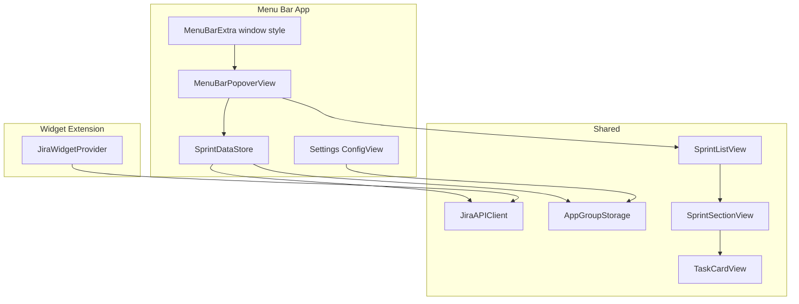

# Menu Bar Sprint Tracker

## Goal

Add a **menu bar icon** that opens a **scrollable popover** (~420x520pt) showing sprint sections and task cards. Keep the existing desktop widget as a secondary at-a-glance view.

## Agreed choices

- **Menu bar + widget** (both coexist)
- **Icon → scrollable popover panel** (not a compact native menu)

## Architecture



## Key implementation decisions

### 1. Use SwiftUI `MenuBarExtra` with `.window` style

Update [`jira-tracker-widget/jira_tracker_widgetApp.swift`](jira-tracker-widget/jira_tracker_widgetApp.swift):

- Replace the default `WindowGroup` as the primary UI with `MenuBarExtra`
- Use `.menuBarExtraStyle(.window)` for a resizable scrollable panel
- Add `Settings { ConfigView() }` so configuration opens via menu bar footer or Cmd+,
- Keep `WidgetCenter.shared.reloadAllTimelines()` on save and when app becomes active

```swift
MenuBarExtra {
    MenuBarPopoverView()
} label: {
    Image(systemName: "checklist")
}
.menuBarExtraStyle(.window)

Settings {
    ConfigView()
}
```

### 2. Extract shared sprint UI into `Shared/Views/`

Move these from the widget extension into Shared (already linked to both app + widget targets):

| From | To |
|------|----|
| [`jira-tracker-wdidget-extension/Views/SprintSectionView.swift`](jira-tracker-wdidget-extension/Views/SprintSectionView.swift) | [`Shared/Views/SprintSectionView.swift`](Shared/Views/SprintSectionView.swift) |
| [`jira-tracker-wdidget-extension/Views/TaskCardView.swift`](jira-tracker-wdidget-extension/Views/TaskCardView.swift) | [`Shared/Views/TaskCardView.swift`](Shared/Views/TaskCardView.swift) |

Add new shared container:

- [`Shared/Views/SprintListView.swift`](Shared/Views/SprintListView.swift) — scrollable `ScrollView` wrapping sprint sections; accepts `WidgetLoadResult` and an `applyTaskLimit: Bool` flag

**Task limit behavior:**
- Widget: `applyTaskLimit: true` (keeps current 6-task cap + "+N more")
- Menu bar: `applyTaskLimit: false` (show all tasks — scroll handles overflow)

Refactor [`Shared/Networking/JiraAPIClient.swift`](Shared/Networking/JiraAPIClient.swift) `buildSections(...)` to accept optional `maxVisibleTasks: Int?` instead of always using `AppConstants.maxVisibleTasksPerSprint`.

Update [`jira-tracker-wdidget-extension/Views/WidgetRootView.swift`](jira-tracker-wdidget-extension/Views/WidgetRootView.swift) to use `SprintListView` from Shared.

### 3. Add `SprintDataStore` for live menu bar data

New file: [`Shared/ViewModels/SprintDataStore.swift`](Shared/ViewModels/SprintDataStore.swift)

```swift
@MainActor
final class SprintDataStore: ObservableObject {
    @Published var result: WidgetLoadResult = .failure(.notConfigured)
    @Published var isLoading = false
    @Published var lastUpdated: Date?

    func refresh() async { ... }  // calls JiraAPIClient.fetchWidgetData
}
```

Refresh triggers:
- Popover appears (`onAppear`)
- User taps **Refresh** in popover footer
- App becomes active (same 30-min policy as widget; optional `Timer` while popover is open)

### 4. Build `MenuBarPopoverView`

New file: [`jira-tracker-widget/Views/MenuBarPopoverView.swift`](jira-tracker-widget/Views/MenuBarPopoverView.swift)

Layout:

```
┌─────────────────────────────────┐
│ Jira Sprint Tracker    [↻]      │  header + refresh button
├─────────────────────────────────┤
│  (scrollable SprintListView)    │  all sprints + tasks
│                                 │
├─────────────────────────────────┤
│ Settings · Quit                 │  footer actions
└─────────────────────────────────┘
```

- Fixed default size: ~420 x 520pt
- Loading state: `ProgressView`
- Error state: reuse same inline messages from `WidgetError`
- Footer **Settings** opens `Settings` scene via `NSApp.sendAction(Selector(("showSettingsWindow:")), ...)`
- Task cards keep `Link` to Jira issue URLs

### 5. Menu-bar-first app behavior

Add to main app build settings in [`jira-tracker-widget.xcodeproj/project.pbxproj`](jira-tracker-widget.xcodeproj/project.pbxproj):

```
INFOPLIST_KEY_LSUIElement = YES
```

This hides the Dock icon so the app lives in the menu bar (standard for utilities). Configuration is still reachable via the popover footer or Cmd+,.

Remove the standalone `WindowGroup` that currently shows `ConfigView` on launch — first launch shows the menu bar icon; user opens Settings from the popover.

### 6. README update

Update [`README.md`](README.md) with:

- How to use the menu bar icon
- How to open Settings (footer link or Cmd+,)
- Note that widget remains optional for desktop glance view

## Files to change

| Action | File |
|--------|------|
| Modify | `jira-tracker-widget/jira_tracker_widgetApp.swift` |
| Add | `jira-tracker-widget/Views/MenuBarPopoverView.swift` |
| Add | `Shared/ViewModels/SprintDataStore.swift` |
| Add | `Shared/Views/SprintListView.swift` |
| Move | `SprintSectionView.swift`, `TaskCardView.swift` → `Shared/Views/` |
| Modify | `Shared/Networking/JiraAPIClient.swift` (optional task limit param) |
| Modify | `jira-tracker-wdidget-extension/Views/WidgetRootView.swift` |
| Modify | `jira-tracker-widget.xcodeproj/project.pbxproj` (LSUIElement) |
| Modify | `README.md` |

## Manual Xcode step (document only)

After pulling changes, verify in Xcode:

1. Main app target still has **App Groups** + network entitlements
2. `Shared/` is in both app and widget target membership (already configured via synchronized groups)
3. Build & run — confirm menu bar icon appears top-right

## Out of scope (for now)

- "Open at Login" launch agent
- Menu bar text summary (e.g. "3d · 5 tasks") — can be a follow-up
- Removing the widget extension target
